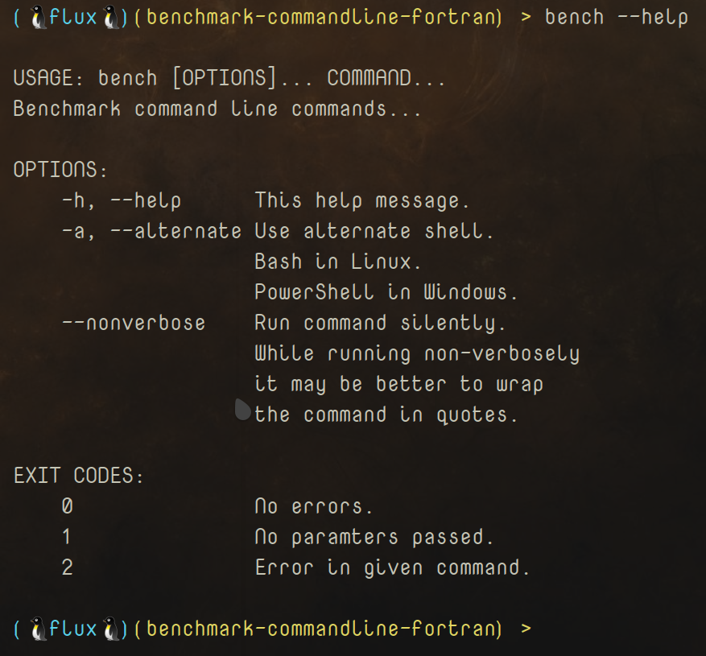
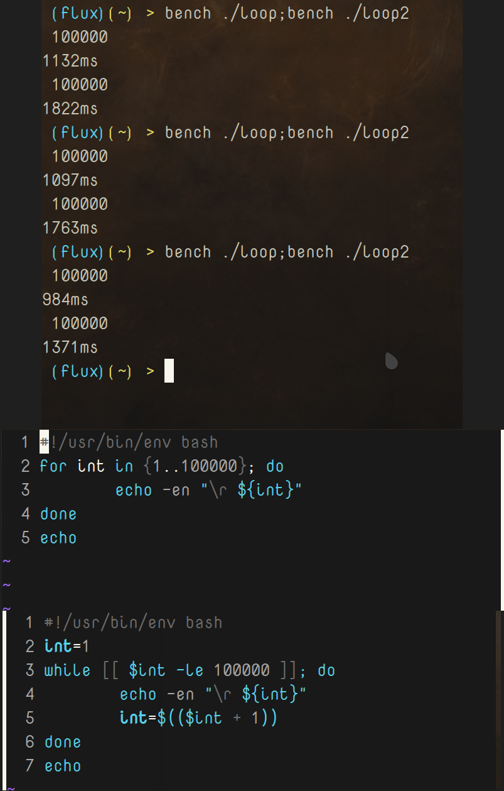

# Bench CLI

Cross-platform command line tool to benchmark commands and other executables/scripts in command lines written in `Fortran`. Very precise and fast. 

**NOTE**: I'm going to be redoing this repository soon with a possible refractor coming not long after. It's also possible I'll be writing a more *portable* version in *`RustLang`*, but I'm a little skeptical because while *Rust* is certainly fast, *Fortran* is a BEAST. 

---

## Support Me If You Like

If you like this project and care to donate to my ***PayPal***:

[](https://paypal.me/ianapride?locale.x=en_US)

Or ***Buy Me A Coffee*** if your prefer:

[](https://www.buymeacoffee.com/ianalanpride)

---

## Disclaimers

I am working on a different version of this written in ***C++*** that works just as well, if not better, and has some more features. Coming very soon. 

<details>
<summary>Disclaimer 1</summary>
The <i>Windows</i> version of this is missing 3 library (DLL) dependecies that can be provided by installing the <code>MinGW</code> version of <code>GCC</code> and <code>GFORTRAN</code> (95) packages and making sure that the <code>MinGW</code> <b>bin</b> directory is in your <code>%PATH%</code>.

I will be working on providing these dependencies soon in one way or another, but I have to put it on hold for a short period of time.

The 3 libraries that are missing are as follows:

<ul>
<li>libgcc_s_dw2-1.dll</li>
<li>libgfortran-5.dll</li>
<li>libquadmath-0.dll</li>
</ul>

More information can be found below in the [Dependencies Section](#dependencies).

</details>

<details>
<summary>Disclaimer 2</summary>
This works great over most commands, but it can be a bit testy with a few commands depending on the output <b><i>unless</i></b> they are in placed in a script and then benchmark the script, of course. Not much difference in results when we are usually just looking for averages speeds in the first place.
</details>

<!-- ## Disclaimer 1

The *Windows* version of this is missing 3 library (DLL) dependecies that can be provided by installing the `MinGW` version of `GCC` and `GFORTRAN` (95) packages and making sure that the `MinGW` **bin** directory is in your `%PATH%`.

I will be working on providing these dependencies soon in one way or another, but I have to put it on hold for a short period of time.

The 3 libraries that are missing are as follows:

- libgcc_s_dw2-1.dll
- libgfortran-5.dll
- libquadmath-0.dll

More information can be found below in the [Dependencies Section](#dependencies). -->

<!-- ## Disclaimer 2

This works great over most commands, but it can be a bit testy with a few commands depending on the output ***unless*** they are in placed in a script and then benchmark the script, of course. Not much difference in results when we are usually just looking for averages speeds in the first place. -->

<!-- The `AppImage` adds at minimum 50ms per test, but then again we are still just worried about averages. -->

|`Build`|`Status`|
|---:|:---|
![AppImage Build Status](https://img.shields.io/static/v1?logo=data:image/png;base64,iVBORw0KGgoAAAANSUhEUgAAAA4AAAAOCAMAAAAolt3jAAAABGdBTUEAALGPC/xhBQAAACBjSFJNAAB6JgAAgIQAAPoAAACA6AAAdTAAAOpgAAA6mAAAF3CculE8AAAB11BMVEUAAAA9U2GDnayLpraOqLeQqbiRqriPqLaPqLaRqriDnaw9U2Fid4SKp7iKp7hid4RfdYGHpbdYbnuCorRSaHV9nrFMYm93ma1HXGlwlKlwlKlBV2NojqQ7UV1hiKA2S1hYgpswRlJQfJcwRlIkMjlDbIVMfJpNfptOfptNfZpRfplTf5lMfJlOfptNfptDbIUkMjkHAAAuR1YzUWMzUWMzUmM0UmQzUWMyUWM0UmQzUmMzUWMzUWMuR1YHAACNsMWRs8aXt8mbuMm3ydSbuMmRs8aIrsONscWStMeZtsfk6u3k6u2ZtseStMeIrsOGrMKKr8SMr8Oswc3u8PHu8PGswc6Mr8OCqcCFrMKJrsOTssTT3OLS3OKTssSJrsOCqcB9pr5/p7+CqcCApryYs8Sdt8aApryCqb9/p799pr52obp4o7x9o7qswc7F09vO2eCwxNCCp7x4ort2obpvnLdxnbd9orjK1t3T3OLK1t7Y4OSFp7twnLZvnbdomLRolrKTsMHb4eWju8mRrsDd4+aiushplrJomLRhkrBik7Bmkq25ydLY3uLW3eHI09ptl69hkrBhkrBZjq1bj65ej613nbSRrr+etsV3nbRika1bjq5Zjq3///97NWaUAAAAP3RSTlMAAlOMioqKioqKUwIMwcEMDsQOxA7EDsQOxMQOxA7EDsQOxA4Lq/Lv7+/v7+/v76sLASI+Pj4+Pj4+Pj4+IgH2SccMAAAAAWJLR0SccbzCJwAAAAd0SU1FB+QIGBYnM5liyzQAAADPSURBVAjXY2BABYxMzCysbOwcnKwszFzcDDy89g6OTs7OLo6u9nz8DAKCbu4enl7ePr7ufoICDELC/gGBQcEhoWEB/sJCDCKi4RGRUdExsXER8aIiDGLiCYlJySmpaekZmeJiDBKSWdk5uXn5BYVFxVISDNIyJaVl5RWVVdU1tTLSDLJydfUNjU3NLa1t7XKyDPIKHZ1d3T29ff0TJirIMygqTZo8Zeq06TNmzpqtpMygoqqmrqGppa2jq6emb8BgaGRsYmpmbmFpZW1jawcAIDgy9UQeYeoAAAAldEVYdGRhdGU6Y3JlYXRlADIwMjAtMDgtMjRUMjI6Mzk6NTEtMDQ6MDBWWeqAAAAAJXRFWHRkYXRlOm1vZGlmeQAyMDIwLTA4LTI0VDIyOjM5OjUxLTA0OjAwJwRSPAAAAABJRU5ErkJggg==&label=AppImage&message=Status&color=b91d47)|

 ![Utility Command Line](https://img.shields.io/static/v1?logo=data:image/png;base64,iVBORw0KGgoAAAANSUhEUgAAAA4AAAAOCAQAAAC1QeVaAAAC4GlDQ1BpY2MAADjLlZTfSxRRFMfPLGNJmZWoPVQ0QZDYFoP2Q4JE11XxR7vbqqVBwezM7O7o7uwwM7u20oMPvvUHWBBF5YMPvdRD2I+HCCJ7CItIe+ixHwa9JUoQbN87d8oKTLpw9n7uPed77rln7y6RuKRYViZARFnTteOdIWlw6Ky0cYEqKEA7qIaqFNWxWmOxXlpzLM+TwObXB1mu3d03h85Pzn27Ik1eejI3X6R/j0obBxIJQXB1inML4wTnfsajruWC04zVtKKBL4KDdn+8DTzN8qQ4zzBOcJ5lXFBTTPsWLJuaYRIFysFNmu6oYHZWQnPULHgKJmazOeQXWc461bKhFV+C97G+8JITe4iOTCL2zeqegVrvfSWqqV3dO3AO5T4lerh9de/TZq9Xwqmok2xs8LaEvbVEW7Ol0ufr0B8lWnFKpZWVUuk7elc2RHTthpq3C36/BOEF0Xprfme+JqGx0Sdai3lfvCHjvHGiQfSlG8ursP24a9VOos7HRNFxEuD2jffQG+Vhw7Eyynpf9/+PbCb/84wqWIWZiETZDFu03Bh7H5WwJafQ185jhEDS6OjiMUK1poR7wJvA0li6LeJzfdLuiPP7CoeHle6Yr9V0c6CP5xQKVsZ7915+yw2x+DrsT+hOO4vZBr49lu4/45/1yM7HB3zt7Eiuh8VvAM9rerj9Zx4zE+n187wz3K5f9VMfjdAw6WRTlk5SjkwyyMVsUwiUIY0cRLz3/BHMRXhdWvZ0H9luqn70Q7K5ePx0+je9Tnn4JKh1fLpQWR4Z8KtelEn5yJZkpWzKz+Rb8n15Qf4iT1EYEQ5iM6RA82c9Erw6vFyfBqvwaVjFEG0iSoEOSlZRYeJyjtUk7hKbxRNikxjC3PJg+u7sK5miiE5APwIzkUHyVrp/W9XLjZvx3yQbcfSuDH1flO48nxn/+624+gXv3bflrKJtpNKu1Ip/JD0odZnqoaDUIMvH6AejuegUonOVSwAAACBjSFJNAAB6JgAAgIQAAPoAAACA6AAAdTAAAOpgAAA6mAAAF3CculE8AAAAAmJLR0QA/4ePzL8AAAAHdElNRQfkCBUQJzdo6KtCAAAA40lEQVQY0z3QPW6TURQE0HO/d22F0CIKFyyANvugo2IVLIyW5VBEWICQgGAl+Pt571LE8ow0zekmXkaLXaSmKUM3nluj8uO7fD/HbLWZpJSaNNXyKfvdw4ejTQlhEkIpB7f3+dt3J2988WhC6Tar7rX86pvu4Gy2WQ2bxeKFVZ48+eneKwc//FW6bvPoJJ8sZumXP5qmCyGszvKfBcV1n7OZ5dmqlHHhMgxltcjNMITA4IrdKlMYF4orDiUqs90gNM2EoduUG7uW++P0+faCcT1haHbHeLvft0nphkKYNJNu6f8ByrJ40c85M8EAAAAldEVYdGRhdGU6Y3JlYXRlADIwMjAtMDgtMjFUMTY6Mzk6NTUtMDQ6MDBkl1zIAAAAJXRFWHRkYXRlOm1vZGlmeQAyMDIwLTA4LTIxVDE2OjM5OjU1LTA0OjAwFcrkdAAAAABJRU5ErkJggg==&label=Utility&message=Command%20Line&color=important) ![Utility Windows](https://img.shields.io/static/v1?logo=data:image/png;base64,iVBORw0KGgoAAAANSUhEUgAAAA4AAAAOCAQAAAC1QeVaAAAC4GlDQ1BpY2MAADjLlZTfSxRRFMfPLGNJmZWoPVQ0QZDYFoP2Q4JE11XxR7vbqqVBwezM7O7o7uwwM7u20oMPvvUHWBBF5YMPvdRD2I+HCCJ7CItIe+ixHwa9JUoQbN87d8oKTLpw9n7uPed77rln7y6RuKRYViZARFnTteOdIWlw6Ky0cYEqKEA7qIaqFNWxWmOxXlpzLM+TwObXB1mu3d03h85Pzn27Ik1eejI3X6R/j0obBxIJQXB1inML4wTnfsajruWC04zVtKKBL4KDdn+8DTzN8qQ4zzBOcJ5lXFBTTPsWLJuaYRIFysFNmu6oYHZWQnPULHgKJmazOeQXWc461bKhFV+C97G+8JITe4iOTCL2zeqegVrvfSWqqV3dO3AO5T4lerh9de/TZq9Xwqmok2xs8LaEvbVEW7Ol0ufr0B8lWnFKpZWVUuk7elc2RHTthpq3C36/BOEF0Xprfme+JqGx0Sdai3lfvCHjvHGiQfSlG8ursP24a9VOos7HRNFxEuD2jffQG+Vhw7Eyynpf9/+PbCb/84wqWIWZiETZDFu03Bh7H5WwJafQ185jhEDS6OjiMUK1poR7wJvA0li6LeJzfdLuiPP7CoeHle6Yr9V0c6CP5xQKVsZ7915+yw2x+DrsT+hOO4vZBr49lu4/45/1yM7HB3zt7Eiuh8VvAM9rerj9Zx4zE+n187wz3K5f9VMfjdAw6WRTlk5SjkwyyMVsUwiUIY0cRLz3/BHMRXhdWvZ0H9luqn70Q7K5ePx0+je9Tnn4JKh1fLpQWR4Z8KtelEn5yJZkpWzKz+Rb8n15Qf4iT1EYEQ5iM6RA82c9Erw6vFyfBqvwaVjFEG0iSoEOSlZRYeJyjtUk7hKbxRNikxjC3PJg+u7sK5miiE5APwIzkUHyVrp/W9XLjZvx3yQbcfSuDH1flO48nxn/+624+gXv3bflrKJtpNKu1Ip/JD0odZnqoaDUIMvH6AejuegUonOVSwAAACBjSFJNAAB6JgAAgIQAAPoAAACA6AAAdTAAAOpgAAA6mAAAF3CculE8AAAAAmJLR0QA/4ePzL8AAAAHdElNRQfkCBUQJzdo6KtCAAAA40lEQVQY0z3QPW6TURQE0HO/d22F0CIKFyyANvugo2IVLIyW5VBEWICQgGAl+Pt571LE8ow0zekmXkaLXaSmKUM3nluj8uO7fD/HbLWZpJSaNNXyKfvdw4ejTQlhEkIpB7f3+dt3J2988WhC6Tar7rX86pvu4Gy2WQ2bxeKFVZ48+eneKwc//FW6bvPoJJ8sZumXP5qmCyGszvKfBcV1n7OZ5dmqlHHhMgxltcjNMITA4IrdKlMYF4orDiUqs90gNM2EoduUG7uW++P0+faCcT1haHbHeLvft0nphkKYNJNu6f8ByrJ40c85M8EAAAAldEVYdGRhdGU6Y3JlYXRlADIwMjAtMDgtMjFUMTY6Mzk6NTUtMDQ6MDBkl1zIAAAAJXRFWHRkYXRlOm1vZGlmeQAyMDIwLTA4LTIxVDE2OjM5OjU1LTA0OjAwFcrkdAAAAABJRU5ErkJggg==&label=Utility&message=Windows&color=yellow) ![Utility Linux](https://img.shields.io/static/v1?logo=data:image/png;base64,iVBORw0KGgoAAAANSUhEUgAAAA4AAAAOCAQAAAC1QeVaAAAC4GlDQ1BpY2MAADjLlZTfSxRRFMfPLGNJmZWoPVQ0QZDYFoP2Q4JE11XxR7vbqqVBwezM7O7o7uwwM7u20oMPvvUHWBBF5YMPvdRD2I+HCCJ7CItIe+ixHwa9JUoQbN87d8oKTLpw9n7uPed77rln7y6RuKRYViZARFnTteOdIWlw6Ky0cYEqKEA7qIaqFNWxWmOxXlpzLM+TwObXB1mu3d03h85Pzn27Ik1eejI3X6R/j0obBxIJQXB1inML4wTnfsajruWC04zVtKKBL4KDdn+8DTzN8qQ4zzBOcJ5lXFBTTPsWLJuaYRIFysFNmu6oYHZWQnPULHgKJmazOeQXWc461bKhFV+C97G+8JITe4iOTCL2zeqegVrvfSWqqV3dO3AO5T4lerh9de/TZq9Xwqmok2xs8LaEvbVEW7Ol0ufr0B8lWnFKpZWVUuk7elc2RHTthpq3C36/BOEF0Xprfme+JqGx0Sdai3lfvCHjvHGiQfSlG8ursP24a9VOos7HRNFxEuD2jffQG+Vhw7Eyynpf9/+PbCb/84wqWIWZiETZDFu03Bh7H5WwJafQ185jhEDS6OjiMUK1poR7wJvA0li6LeJzfdLuiPP7CoeHle6Yr9V0c6CP5xQKVsZ7915+yw2x+DrsT+hOO4vZBr49lu4/45/1yM7HB3zt7Eiuh8VvAM9rerj9Zx4zE+n187wz3K5f9VMfjdAw6WRTlk5SjkwyyMVsUwiUIY0cRLz3/BHMRXhdWvZ0H9luqn70Q7K5ePx0+je9Tnn4JKh1fLpQWR4Z8KtelEn5yJZkpWzKz+Rb8n15Qf4iT1EYEQ5iM6RA82c9Erw6vFyfBqvwaVjFEG0iSoEOSlZRYeJyjtUk7hKbxRNikxjC3PJg+u7sK5miiE5APwIzkUHyVrp/W9XLjZvx3yQbcfSuDH1flO48nxn/+624+gXv3bflrKJtpNKu1Ip/JD0odZnqoaDUIMvH6AejuegUonOVSwAAACBjSFJNAAB6JgAAgIQAAPoAAACA6AAAdTAAAOpgAAA6mAAAF3CculE8AAAAAmJLR0QA/4ePzL8AAAAHdElNRQfkCBUQJzdo6KtCAAAA40lEQVQY0z3QPW6TURQE0HO/d22F0CIKFyyANvugo2IVLIyW5VBEWICQgGAl+Pt571LE8ow0zekmXkaLXaSmKUM3nluj8uO7fD/HbLWZpJSaNNXyKfvdw4ejTQlhEkIpB7f3+dt3J2988WhC6Tar7rX86pvu4Gy2WQ2bxeKFVZ48+eneKwc//FW6bvPoJJ8sZumXP5qmCyGszvKfBcV1n7OZ5dmqlHHhMgxltcjNMITA4IrdKlMYF4orDiUqs90gNM2EoduUG7uW++P0+faCcT1haHbHeLvft0nphkKYNJNu6f8ByrJ40c85M8EAAAAldEVYdGRhdGU6Y3JlYXRlADIwMjAtMDgtMjFUMTY6Mzk6NTUtMDQ6MDBkl1zIAAAAJXRFWHRkYXRlOm1vZGlmeQAyMDIwLTA4LTIxVDE2OjM5OjU1LTA0OjAwFcrkdAAAAABJRU5ErkJggg==&label=Utility&message=Linux&color=informational)

|Total Downloads This Project|
|:---:|
| |

## Table of Contents

- [Bench CLI](#bench-cli)
  - [Disclaimers](#disclaimers)
  - [Table of Contents](#table-of-contents)
  - [Motivation](#motivation)
  - [Usage](#usage)
    - [Command Line](#command-line)
    - [Linux Permissions](#linux-permissions)
    - [Dependencies](#dependencies)
      - [Linux Dependencies](#linux-dependencies)
        - ['APT' Based](#apt-based)
        - [Other packaging systems](#other-packaging-systems)
      - [Windows Dependencies](#windows-dependencies)
  - [Files](#files)
    - [Linux Files](#linux-files)
    - [Windows Files](#windows-files)
  - [Project Links](#project-links)
    - [AppImage Hub](#appimage-hub)
  - [Media](#media)
    - [Help](#help)
    - [For Vs. While Example](#for-vs-while-example)
  - [License](#license)

## Motivation

I like to benchmark ***EVERYTHING***. Plain and simple.

## Usage

Usage is the same in both Windows and Linux. In *Linux* there are 2 options; a small executable that depends on *gcc*/*gfortran* or an `.AppImage`  that has all dependencies included. The *Windows* version has an executable and depends on *gcc*/*gfortran* as well; here I have used the `MinGW` versions. For the *Linux* version I have an `AppImage` for as a single distibutable package, but I need to come up with a way to do so for the *Windows* version. For now you can install the afore mentioned packages in both operating systems. 

See [*For Vs. While*](#for-vs-while-example) for a basic example. This can be used in many ways.

### Command Line

```Bash
 $ bench --help

 USAGE: bench [OPTIONS]... COMMAND... 
 Benchmark command line commands...

 OPTIONS:
     -h, --help      This help message.
     -a, --alternate Use alternate shell.
                     Bash in Linux.
                     PowerShell in Windows.
     --nonverbose    Run command silently.
                     While running non-verbosely
                     it may be better to wrap
                     the command in quotes.

 EXIT CODES:
     0               No errors.
     1               No paramters passed.
     2               Error in given command.

 $ bench "ls /usr/bin" --nonverbose
 10ms
 $
```
### Linux Permissions

You may have to set the files permissions to be executable in *Linux*.

Set executable for `$USER` only:

```Bash
 $ chmod u+x /path/to/bench
```

Or for everyone:

```Bash
 $ chmod 755 /path/to/bench-x86_64.AppImage
```

### Dependencies

As stated above this program depends on a few libraries from 2 programs (`GCC` and `GFORTRAN`) that can be installed in both *Windows* and *Linux*.

#### Linux Dependencies

Installing `GCC` and `GFORTRAN` in various *Linux* distributions:

Libraries needed:

- libc.so
- libgfortran.so.4
- libm.so.6
- libquadmath.so.0

##### 'APT' Based
  
```Bash
 $ sudo apt install gcc gfortran # add -y to skip affirmation.
```

##### Other packaging systems

I'm sorry, there are various ways to install these package in other packaging systems and it looks like they are under various names, but you should be able to figure out their names by the 2 names provided here.

#### Windows Dependencies

Installing `GCC` and `GFORTRAN` in various *Windows* distributions:

Libraries needed:

- libgcc_s_dw2-1.dll
- libgfortran-5.dll
- libquadmath-0.dll

I have installed these using the MinGW environment from here:

[MinGW @ SourceForge](https://sourceforge.net/projects/mingw-w64/)

The `c:/mingw/bin` directory (or wherever your `bin` directory is located) must be present in `%PATH%`.

## Files

These should be all up-to-date files, but the `Continuous Build` release page should always be the "Current Release". Link can be found in [*Project Links*](#project-links) below.

File|Description
---:|:---
[Source Files - All](source_all.7z)|Complete project - no compilations.

### Linux Files

File|Description
---:|:---
[Source Files](source_linux.7z)|Linux source - no compilations.
[Compiled](dist/linux/bin/bench)|Compiled binary executable without dependencies.
[Source Files - AppImage](source_appimage.7z)|`AppImage` source.
[Compiled - AppImage](dist/linux/appimage/bench-x86_64.AppImage)| `.AppImage` with dependencies included. An *AppImage* can be renamed to whatever you like.

### Windows Files

File|Description
---:|:---
[Source Files](source_windows.7z)|Windows source - no compilations.
[Compiled](dist/windows/bin/bench.exe)|Compiled binary executable.

## Project Links

- [Official Project](https://lateralus138.github.io/bench-cli)
- [This Repository](https://github.com/Lateralus138/bench-cli)
- [Continuous Build - Current Releases](https://github.com/Lateralus138/bench-cli/releases/tag/Continuous)

### AppImage Hub

- [AppImage at the AppImage Hub](https://appimage.github.io/Bench_CLI/)

## Media

### Help



### For Vs. While Example



## [License](./LICENSE)

>This program is free software: you can redistribute it and/or modify it under the terms of the GNU General Public License as published by the Free Software Foundation, either version 3 of the License, or (at your option) any later version.

>This program is distributed in the hope that it will be useful, but WITHOUT ANY WARRANTY; without even the implied warranty of MERCHANTABILITY or FITNESS FOR A PARTICULAR PURPOSE.  See the GNU General Public License for more details.

